# Hi, I'm Khanh 👋

### Cybersecurity Student • Blue Team • SOC • DFIR

Building hands-on cybersecurity labs focused on endpoint monitoring,  
threat detection, log analysis and incident response.

---

## 👨‍💻 About Me

- 🎓 Information Security student
- 🔐 Interested in Blue Team, SOC, DFIR and Detection Engineering
- 🧪 Building practical home labs with Wazuh, Splunk and Snort
- 🕵️ Learning threat hunting, malware behavior analysis and incident response
- 📝 Sharing cybersecurity projects and technical notes on my portfolio

---

## 🛠️ Technologies & Tools

---

## 🚀 Featured Projects

### 🔎 DFIR Wazuh Home Lab

A practical DFIR home lab for endpoint monitoring, security-event
investigation and incident-response practice.

➡️ [View project](https://github.com/kh4nhc4nh/dfir-wazuh-home-lab)

### 🦠 Wazuh–Snort Malware Behavior Detection Lab

A security lab focused on detecting suspicious endpoint and network
behavior using Wazuh and Snort.

➡️ [View project](https://github.com/kh4nhc4nh/wazuh-snort-malware-behavior-detection-lab)

### 📊 Active Directory and Splunk Lab

A hands-on environment for collecting and analyzing Active Directory
security logs with Splunk.

➡️ [View project](https://github.com/kh4nhc4nh/ad-splunk)

### 🌐 Personal Cybersecurity Portfolio

My personal website for publishing cybersecurity projects, learning notes
and laboratory documentation.

➡️ [Visit website](https://kh4nhc4nh.github.io)

---

## 📊 GitHub Statistics

---

## 🎯 Current Goals

- Improve my SOC investigation and incident-response skills
- Build detection rules for Windows and Active Directory attacks
- Practice threat hunting with Wazuh and Splunk
- Develop a professional cybersecurity portfolio
- Prepare for a Blue Team or SOC Analyst position

---

## 📫 Contact

- 🌐 Portfolio: [kh4nhc4nh.github.io](https://kh4nhc4nh.github.io)
- 💻 GitHub: [github.com/kh4nhc4nh](https://github.com/kh4nhc4nh)

---

### Thanks for visiting my profile! 👋

